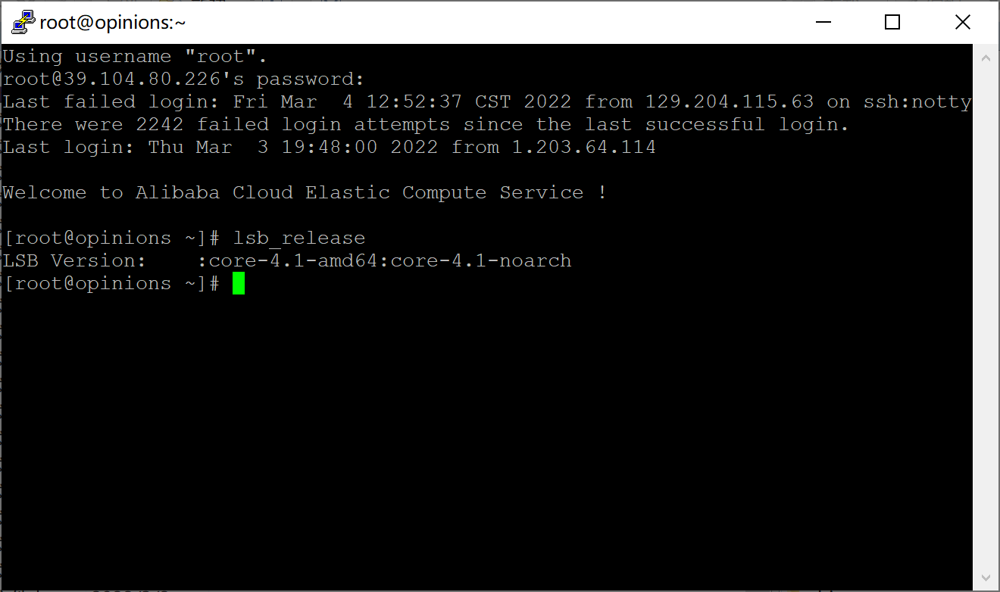

# H1

全程录屏解说：[https://www.bilibili.com/video/BV12U4y1f7Cc/](https://www.bilibili.com/video/BV12U4y1f7Cc/)

<iframe src="//player.bilibili.com/player.html?aid=682097098&bvid=BV12U4y1f7Cc&cid=541948691&page=1" scrolling="no" border="0" frameborder="no" framespacing="0" allowfullscreen="true"> </iframe>

## 当前 Linux 发行版基本信息

```bash
lsb_release
```

遇到问题：

```bash
No LSB modules are available.
```

解决方法：`apt install lsb-core`



## 当前 Linux 内核版本信息

```bash
uname -a
```


## **Virtualbox 安装完 Ubuntu 之后新添加的网卡如何实现系统开机自动启用和自动获取 IP**

### 方式一

首先在虚拟机设置里添加网卡


随后查看添加的网卡名`ifconfig`


随后编辑`/etc/netplan/00-installer-config.yaml`

修改为：

```bash
network:
  ethernets:
    ens33:
      dhcp4: true
  version: 2
```

其中`dhcp4: true`表示启用自动获取ip。

遇到问题：已经有`NetworkManager`了，需要卸载才能完成实验`apt purge network-manager`

### 方法二

装桌面环境，用`NetworkManager`

## **使用 scp 在「虚拟机和宿主机之间」、「本机和远程 Linux 系统之间」传输文件**

将宿主机的`C:\Users\lenovo\Desktop\新建文件夹 (2)\test.txt`传到`/home/ubuntu/Desktop`目录下，虚拟机的ip为`192.168.67.129`。

```bash
scp "C:\Users\lenovo\Desktop\½ļ (2)\test.txt" ubuntu@192.168.67.129:/home/ubuntu/Desktop
```


将虚拟机`/home/ubuntu/Desktop`的传到`C:\Users\lenovo\Desktop\新建文件夹 (2)\test1.txt`目录下，虚拟机的ip为`192.168.67.129`。

```bash
scp ubuntu@192.168.67.129:/home/ubuntu/Desktop/test.txt "C:\Users\lenovo\Desktop\test\test1.txt" 
```


> 遇到问题：最好不用中文名，不然可能有编码问题，导致目录不对，传输失败。
>

## **配置 SSH 免密登录**

生成密钥对

```bash
ssh-keygen
```


随后将密钥对传入需要免密登录的主机中

```bash
ssh-copy-id -i /home/kali/.ssh/id_rsa.pub ubuntu@192.168.67.129
```


测试免密登录成功

