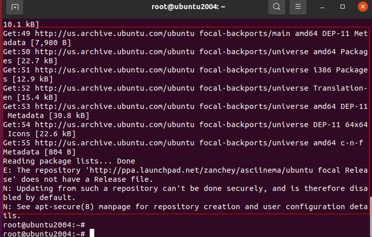
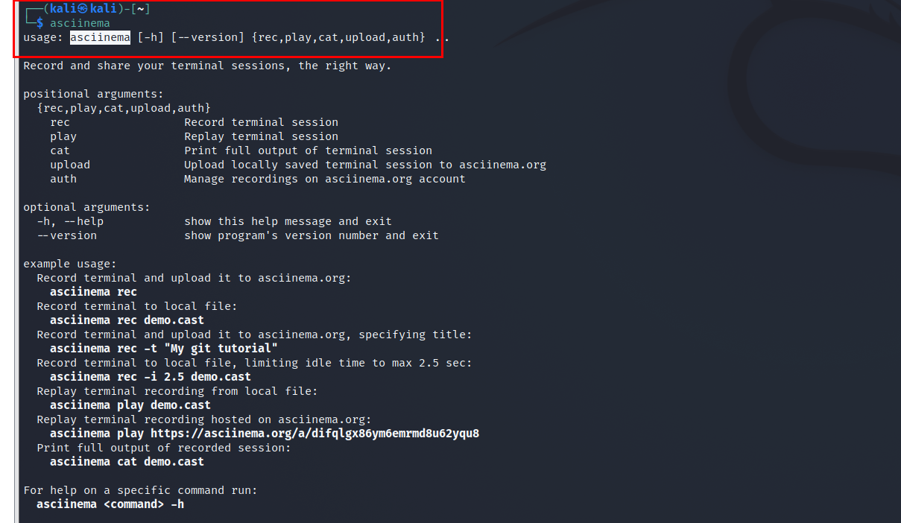

# H2

# 实验环境

首先是实验的环境，我的实验环境都是在我本地的虚拟机上面，一个是 Ubuntu 的虚拟机，然后另外一个是Kali（基于Debian）的虚拟机。

# 注册asciinema

首先第1步是要打开这个网站，然后网站的界面就和截图是一样的。


随后使用邮箱进行注册。


注册之后会在邮箱收到发送过来的验证码。


点击它发送过来的链接就可以完成注册。


随后就可以成功进入到用户界面。


但是进入到这个用户界面之后会看到说，其实这个时候他说你必须要先确认你的这个录制的工具是已经安装了，但是我们就是并没有安装，所以这个时候需要在虚拟机的系统里面进行这个录制工具的安装，我们点击它的链接进入到它安装的这个教学。


进来之后可以看到还有在很多不同的这个系统上的安装的教程，然后我们就选择在Linux系统上进行安装。


点击这个链接，就会有跳转到具体的安装的命令上。


然后我们需要在这里选择合适的这个系统，我这边用的是 Ubuntu ，所以我就复制 Ubuntu 的命令。


也就是我们在虚拟机里面把刚刚复制的命令粘贴之后就会开始自动安装。


没看到安装的这个过程出错了，我们尝试更新一下源，然后再继续进行。



更新之后，这个就可以成功安装了，可以看到两台虚拟机都已经成功安装了，并且可以运行这个命令。




截止到目前这两台我实验要用到的机子上都成功安装了，需要用来录屏的软件，接下来就开始进行实验的部分。

# **软件包管理**

安装软件的命令就是之前用的安装的命令一样的格式：

```bash
sudo apt install tmux tshark
whereis tmux 
whereis tshark
sudo apt remove tshark
```

在安装完成之后，如果我直接输入`tshark`命令是会开始进行抓包的，并且会告诉我正在捕获的网卡，所以我在卸载的时候就只需要验证我输入这个命令的时候还能不能生效就可以了，如果他找不到这个可执行文件，就说明我已经把这个软件给卸载掉了。

输入之前需要使用下面这个命令开始进行录屏。

```bash
asciinema rec
```

开始录屏之后进行正常的操作操作之后点击确定或者是按回车就可以把布置的视频上传到网站上。

我们是先在 Ubuntu 进行操作的，所以先录制的就是 Ubuntu 这个系统下面的操作的一个录屏。

[录屏](https://asciinema.org/a/gCPuyUSPQJVAb5mPMpbeFoVLL)

接下来就是要录制Kali的部分。

这里出现了一个问题，就是录制出来的，是存在文字重叠的情况。


猜测可能是因为，终端窗口是全屏的原因，所以我们可以把窗口缩小之后再试一下。


可以看到经过调整窗口的大小之后就得到了正常的录屏的结果，并且文字也没有重叠被猜测，可能的原因是在全屏的状态下，这个软件没有办法处理分辨率或者什么这种屏幕参数的关系，就导致了这个文字重叠的情况的发生，通过把窗口缩小，然后在窗口模式下进行命令行的输入和处理就可以解决这个问题。


[录屏](https://asciinema.org/a/alSGkEbgzEZybxOUiVoq8yy1n)

# **文件管理**

第1个命令是用来找到/tmp目录和它的子目录下面文件名包含666的所有文件，就需要用到两个通配符，因为包含的话，可能你左边需要有通用的匹配，右边也需要 ；就是说可能666的左边和右边都有我们这个通配符。

```bash
sudo find /tmp -name "*666*"
```

```bash
sudo grep -r "666" /tmp/ --exclude "*.cast"
```

[录屏](https://asciinema.org/a/cGduo8Eo8K5bJhQXQQXTW1UHf)

[录屏](https://asciinema.org/a/OljhMWVCSP0oSG54pLZDtvXLS)

遇到的比较关键的问题就是在搜索文件的内容的时候，需要排除掉当前正在写入的文件，比如说在我们现在这个情况下，当前的录屏软件就会向我们需要搜索的目录里面进行文件的写入，但是如果他一边写入我们在一边搜索的话，因为写入的时候会更新数据，那么搜索就会造成这个卡死的情况，所以这里我们需要用到`exclude`这个参数来进行排除。

# 文件解压缩

这里的录屏使用的就是，unzip命令来对压缩完成的文件进行解压缩。

```bash
unzip file.zip
```

[录屏](https://asciinema.org/a/CsdYKAkipKJZpUqhKu4ZJFPMA)

[录屏](https://asciinema.org/a/kHGETeSPbJMO58h7MYA1adm5B)

# 进程管理实验

[录屏](https://asciinema.org/a/aMBPeTiMHWR0rx0SQyDAndZMf)

# 查看信息

```bash
lscpu | grep -E '^Thread|^Core|^Socket|^CPU\(' #cpu
free -m #内存信息
sudo fdisk -l |grep "Disk /dev/sd" # 硬盘数量和大小
```

[录屏](https://asciinema.org/a/h3AJj1eZzbvbCQyydNaLOFRAo)

[录屏](https://asciinema.org/a/W0wcIXI3iLASg1qFDHOsGCqNo)