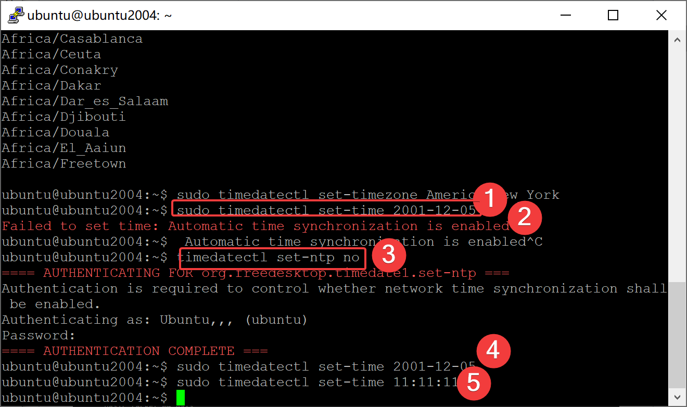
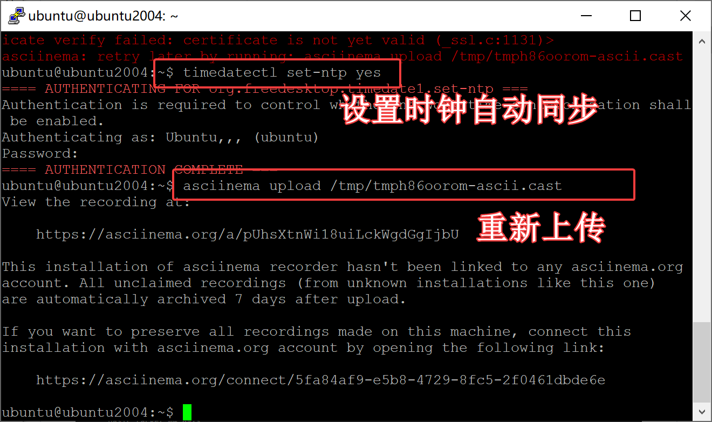
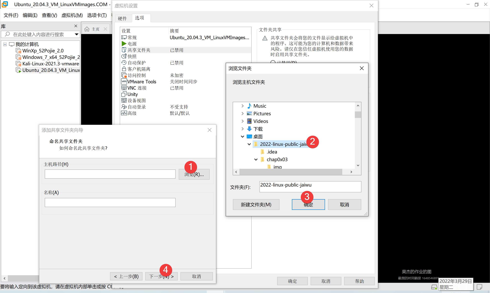

# 第三次作业

## Winscp和 Putty连接

这次作业用ssh连接到虚拟机里做。

我用的客户端是`Winscp`和`Putty`。

先查看一下虚拟机的IP。

使用的命令是 `ifconfig`。


得到了结果：


可以看到，ip是 `192.168.67.129` 。

然后打开 `Winscp`。

根据序号 新建一个站点


点击保存，连接。

连接成功，进入`/home/ubuntu`目录。


点击按钮，打开 `Putty`。


输入密码，登录成功。


## systemctl命令练习

输入 `sudo systemctl reboot`，可以看到连接断开，说明系统重启了。


## systemd-analyze 命令练习

```shell
# 查看启动耗时
$ systemd-analyze                                                                                       

# 查看每个服务的启动耗时
$ systemd-analyze blame

# 显示瀑布状的启动过程流
$ systemd-analyze critical-chain

# 显示指定服务的启动流
$ systemd-analyze critical-chain atd.service
```

[](https://asciinema.org/a/rjWbLahdL5zf8DMrqkDomp9pn)

## hostnamectl 命令练习

```shell
# 显示当前主机的信息
$ hostnamectl

# 设置主机名。
$ sudo hostnamectl set-hostname rhel7
```

[](https://asciinema.org/a/9ZcNTkGzcAoh5D3b7n9kveU5g)

## localectl 命令练习

```shell
# 显示当前主机的信息
# 查看本地化设置
$ localectl

# 设置本地化参数。
$ sudo localectl set-locale LANG=en_GB.utf8
$ sudo localectl set-keymap en_GB
```

[](https://asciinema.org/a/INw1kIwKAG3ezKmV3KEIgi3Gw)

## timedatectl 命令练习

```shell
# 查看当前时区设置
$ timedatectl

# 显示所有可用的时区
$ timedatectl list-timezones                                                                                   

# 设置当前时区
$ sudo timedatectl set-timezone America/New_York
$ sudo timedatectl set-time YYYY-MM-DD
$ sudo timedatectl set-time HH:MM:SS
```

遇到问题：


是系统的自动同步时间被打开了，关掉就行。

命令是：

```timedatectl set-ntp no```



但是上传的时候出错了


因为asciinema上传走的是https协议，用ssl，时钟不同步是没法握手的。

于是上传前把时间同步一下，再上传就成功了。



[](https://asciinema.org/a/pUhsXtnWi18uiLckWgdGgIjbU)

## loginctl

```shell
# 列出当前session
$ loginctl list-sessions

# 列出当前登录用户
$ loginctl list-users

# 列出显示指定用户的信息
$ loginctl show-user ruanyf
```

[](https://asciinema.org/a/Kn6HCbBPMDqdUGNiGYfRPkOpI)

## Unit 相关命令练习

[](https://asciinema.org/a/bZFibQ43arI2TrxkDwRRKlS0f)

## Target 命令相关练习

[](https://asciinema.org/a/ClqE4JZVpY7C8FlTgjRMnVJ2w)

## 日志管理

[](https://asciinema.org/a/mmYdg9zQDYbLPUVrLN31qpcO9)

## 开机启动 启动服务器 停止服务

[](https://asciinema.org/a/9xR25fdt6LbLLburUz9D6MWox)

## 如何添加一个用户并使其具备sudo执行程序的权限

首先用`adduser`命令创建一个新用户。


然后加到sudo组：

```sudo usermod -G sudo -a kriswu```


## 如何将一个用户添加到一个用户组

以添加到sudo组为例：

```sudo usermod -G sudo -a kriswu```

命令格式是：

```usermod -a -G <groupname> <username>```


## 如何查看当前系统的分区表和文件系统详细信息

使用`sudo fdisk -l `命令查看即可：


## 如何实现开机自动挂载Virtualbox的共享目录分区

没有`Virtualbox`，用`Vmware`试试。

先添加共享文件夹





可以看到，`Vmware`自动挂载好了。


Vbox如果不能自动挂载的话可以用`mount`命令手动挂载，或者写入`/etc/fstab`文件完成自动挂载。

## 基于LVM的分区如何实现动态扩容和缩减容量

使用命令 `lvextend` 

用法：lvextend -L/-l 扩展的大小 /dev/VG_NAME/LV_NAME

选项：

      -L：指定扩展（后）的大小。例如，-L +800M表示扩大800M，而-L 800M表示扩大至800M

      -l：指定扩展（后）的大小（LE数）

## 如何通过Systemd设置实现在网络连通时运行一个指定脚本，在网络断开时运行另一个脚本


在 /usr/lib/systemd/system 中新建`test.service`文件：

```
[Unit]
Description=start after network connected
After=network-online.target # 网络连接之后
[Service]
Type=oneshot # 执行一次
ExecStart=/bin/bash -e  /home/pi/set_ip_and_gw.sh #要执行的脚本
KillSignal=SIGINT
After=network-online.target
[Install]
WantedBy=network-online.target
```

## 如何通过systemd设置实现一个脚本在任何情况下被杀死之后会立即重新启动，实现杀不死

在service文件中设置：
```
[Service]
Restart = always
```
这样死了就会重启，杀不死。