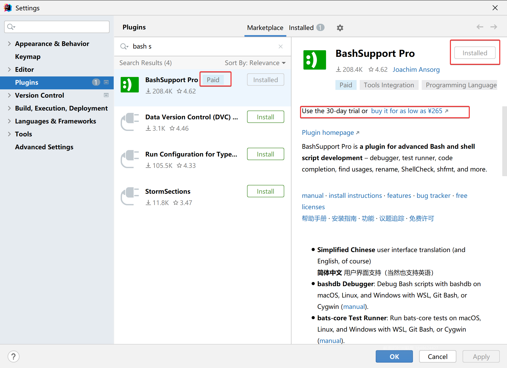
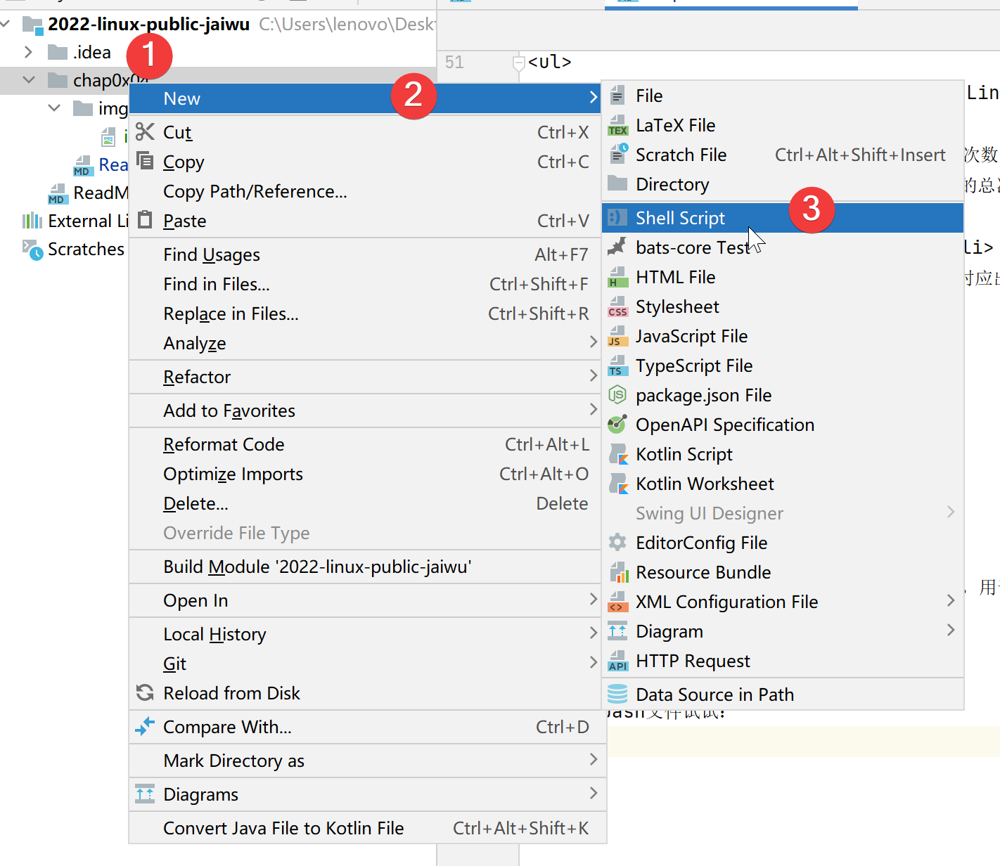
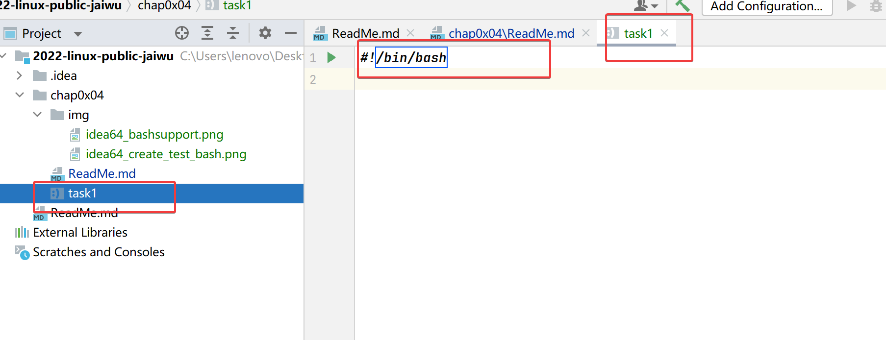
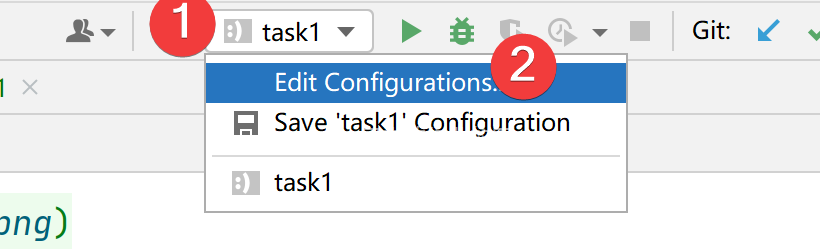
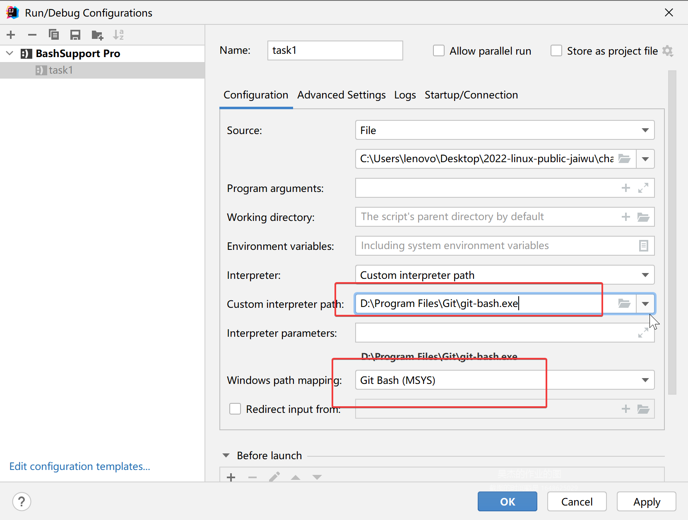
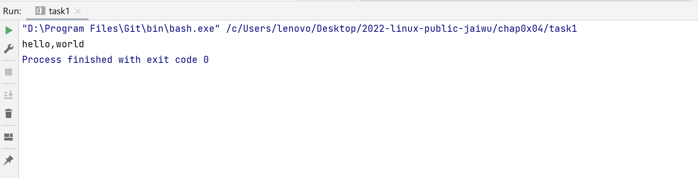
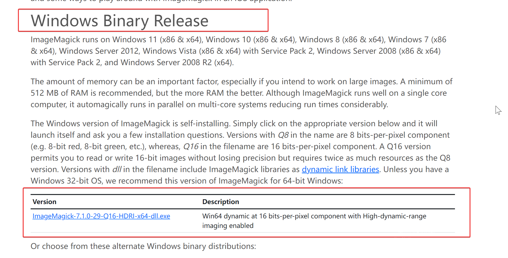
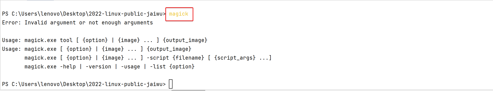

# 第四次作业

## 作业要求

<ul>
<li>任务一：用bash编写一个图片批处理脚本，实现以下功能：
<ul>
<li>支持命令行参数方式使用不同功能</li>
<li>支持对指定目录下所有支持格式的图片文件进行批处理</li>
<li>支持以下常见图片批处理功能的单独使用或组合使用
<ul>
<li>支持对jpeg格式图片进行图片质量压缩</li>
<li>支持对jpeg/png/svg格式图片在保持原始宽高比的前提下压缩分辨率</li>
<li>支持对图片批量添加自定义文本水印</li>
<li>支持批量重命名（统一添加文件名前缀或后缀，不影响原始文件扩展名）</li>
<li>支持将png/svg图片统一转换为jpg格式图片</li>
</ul></li>
</ul></li>
</ul>

<ul>
<li>任务二：用bash编写一个文本批处理脚本，对以下附件分别进行批量处理完成相应的数据统计任务：
<ul>
<li><a href="https://c4pr1c3.github.io/LinuxSysAdmin/exp/chap0x04/worldcupplayerinfo.tsv">2014世界杯运动员数据</a>
<ul>
<li>统计不同年龄区间范围（20岁以下、[20-30]、30岁以上）的球员<strong>数量</strong>、<strong>百分比</strong></li>
<li>统计不同场上位置的球员<strong>数量</strong>、<strong>百分比</strong></li>
<li>名字最长的球员是谁？名字最短的球员是谁？</li>
<li>年龄最大的球员是谁？年龄最小的球员是谁？</li>
</ul></li>
</ul></li>
</ul>

<ul>
<li>任务二：用bash编写一个文本批处理脚本，对以下附件分别进行批量处理完成相应的数据统计任务：
<ul>
<li><a href="https://c4pr1c3.github.io/LinuxSysAdmin/exp/chap0x04/web_log.tsv.7z">Web服务器访问日志</a>
<ul>
<li>统计访问来源主机TOP 100和分别对应出现的总次数</li>
<li>统计访问来源主机TOP 100 IP和分别对应出现的总次数</li>
<li>统计最频繁被访问的URL TOP 100</li>
<li>统计不同响应状态码的出现次数和对应百分比</li>
<li>分别统计不同4XX状态码对应的TOP 10 URL和对应出现的总次数</li>
<li>给定URL输出TOP 100访问来源主机</li>
</ul></li>
</ul></li>
</ul>

<ul>
<li>任务二：用bash编写一个文本批处理脚本，对以下附件分别进行批量处理完成相应的数据统计任务：
<ul>
<li><a href="https://c4pr1c3.github.io/LinuxSysAdmin/exp/chap0x04/web_log.tsv.7z">Web服务器访问日志</a>
<ul>
<li>统计访问来源主机TOP 100和分别对应出现的总次数</li>
<li>统计访问来源主机TOP 100 IP和分别对应出现的总次数</li>
<li>统计最频繁被访问的URL TOP 100</li>
<li>统计不同响应状态码的出现次数和对应百分比</li>
<li>分别统计不同4XX状态码对应的TOP 10 URL和对应出现的总次数</li>
<li>给定URL输出TOP 100访问来源主机</li>
</ul></li>
</ul></li>
</ul>

## 配置开发环境

用 `IDEA` 写代码，用我安装`git bash`时候帮我安装的`bash`调试。

先安装 IDEA 的 BashSupport 插件，要钱，没有，用试用版，可以试用30天。



新建一个bash文件试试：



新建成功，并且很贴心的帮我写好了第一行。



尝试写一段测试代码：

```shell
#!/bin/bash

echo "hello,world"
```

然后需要设置一下用来运行的解释器，他自动设置的好像是有点问题的，应该是系统自带的有点问题。








然后安装一下老师推荐的这个工具来做图片的处理。

首先到[下载页面](https://imagemagick.org/script/download.php)下载。

我这里选择的是Windows版本。



用自带的安装程序安装就行。



这样一来开发的环境就搭建好了。


## 任务一

接下来完成一下任务一。

首先来写一下各个功能的函数。


