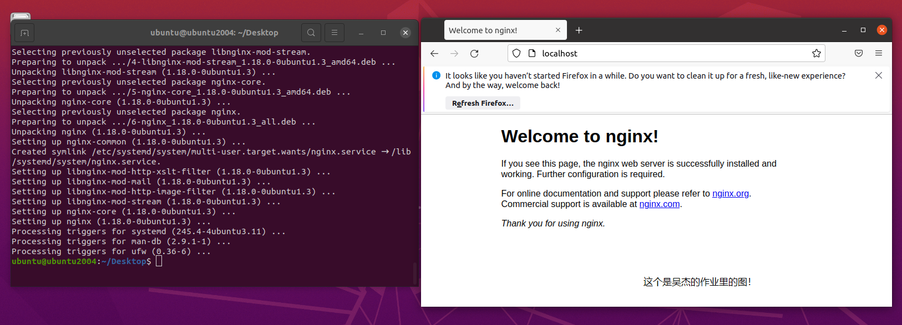
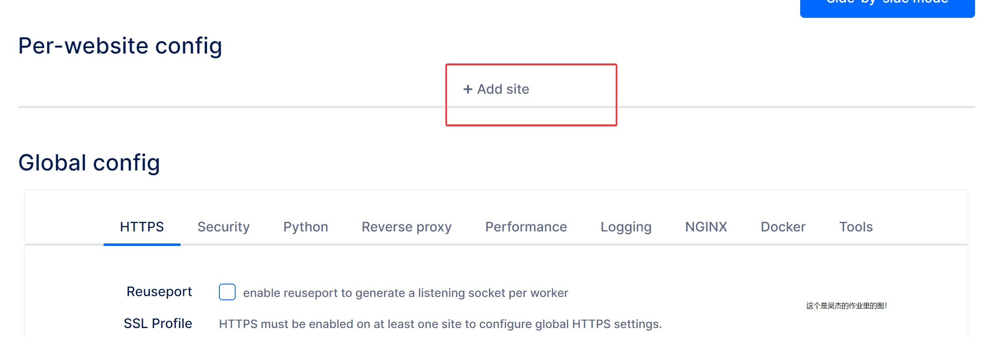
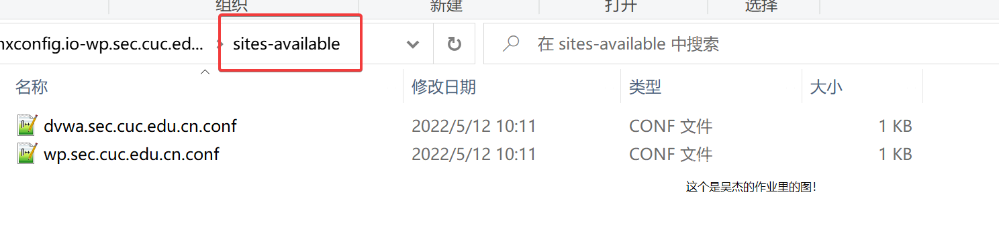
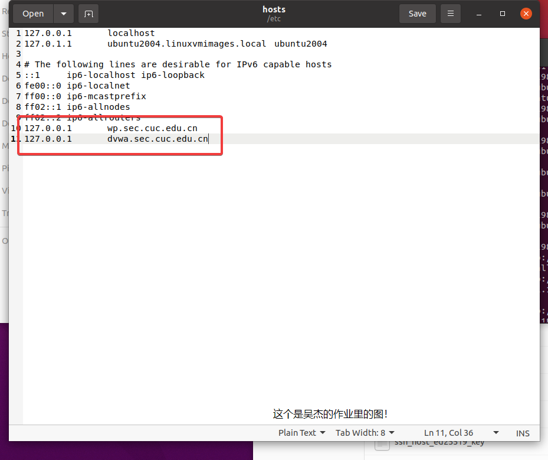

# 实验环境

什么都没装的Ubuntu虚拟机

```
Linux ubuntu2004 5.11.0-27-generic #29~20.04.1-Ubuntu SMP Wed Aug 11 15:58:17 UTC 2021 x86_64 x86_64 x86_64 GNU/Linux
```

# 安装NGINX

参考[https://ubuntu.com/tutorials/install-and-configure-nginx#2-installing-nginx](https://ubuntu.com/tutorials/install-and-configure-nginx#2-installing-nginx)，用命令

```bash
sudo apt update
sudo apt install nginx
```

能找到nginx的包，说明源里面是有的，等他安装一下



装完

# 配置虚拟主机

配置文件在`/etc/nginx/sites-available/`

然后启用的方式就是创建一个软连接到`/etc/nginx/sites-enabled/`

这里要装两个站，一个是wp的，一个是dm什么的

有点麻烦，而且wp还要配置一下rewrite保证伪静态啥的

所以就找了个网站来生成规则

网站是[https://www.digitalocean.com/community/tools/nginx](https://www.digitalocean.com/community/tools/nginx)

先添加一个站点



选择是PHP项目，选WP应该也行，没试过


填入域名，取消子域名重定向


填上路径，这里我的wp下载了放在桌面


实验要求里是http，所以关掉ssl


php模块的路径需要从ubuntu的示例文件里看一下

这里它已经给我装好了

不是我不装

是它已经装好了

后面也是可以用的


复制，填入，同时启用wp的规则


这里反代先不写，后面用verynginx弄


路由就按照他默认的就行


然后弄dv什么的


剩下的和之前的一样

写完之后点击下载


解压后得到


稍微检查一下



这块写错了 只要root就行，public删掉


然后把整个复制到配置目录 下，重启nginx

但是因为这里域名没有解析 所以需要设置个host



# 装VeryNginx

先clone

```bash
git clone https://github.com/alexazhou/VeryNginx.git
```

这里先自己编译一下带openresty verynginx的版本太老了 不好用 过程不是重点 简单记下代码

```bash
#先装luajit
wget -c http://luajit.org/download/LuaJIT-2.0.4.tar.gz
tar zxf LuaJIT-2.0.4.tar.gz
cd LuaJIT-2.0.4
make
make install PREFIX=/usr/local/luajit
cd /root
wget -c https://github.com/openresty/lua-nginx-module/archive/v0.10.7.tar.gz && tar zxf v0.10.7.tar.gz
wget -c https://github.com/simpl/ngx_devel_kit/archive/v0.3.0.tar.gz && tar zxf v0.3.0.tar.gz
export LUAJIT_LIB=/usr/local/luajit/lib
export LUAJIT_INC=/usr/local/luajit/include/luajit-2.0

cat > /etc/ld.so.conf.d/luajit.conf<<EOF
/usr/local/luajit/lib
EOF

ldconfig

```

openresty不装的话verynginx也装不了 因为用了lua的模块

然后安装就行 这里我已经装了自己的openresty就不用他帮我装了

```bash
python install.py install verynginx
```

重启openresty发现报错了

应该是openresty的问题，lua相关的lib没安装，装的时候可能版本不够

找到openresty：[https://github.com/openresty/lua-resty-core](https://github.com/openresty/lua-resty-core)

下载下来 把lib文件夹里的东西复制到虚拟机里lua目录

就可以了


装完后要改下nginx的端口 因为verynginx是另起了一套监听的服务 会冲突

为什么不改verynginx的改nginx的

是因为

verynginx是用来反代的

域名http默认到80端口 要给verynginx

nginx的就无所谓 只要在verynginx里配置反代就行

# 设置反代

先要把被反代的nginx监听的端口设置到8080

这样不会和用来反代的nginx（openresty）冲突


然后设置一下verynginx里面的


保存的时候会出错 因为进程没权限

设置一下就行


但是设置完发现访问wp的域名会到dvwa


这个可能是verynginx没有把请求头HOST转发

因此要手动配置一下matcher 不能靠他


然后试试dv


试试wp


ok了

# 安装wp

WP需要安装一下才会建表，建表了才有用户，才能被枚举

这里还要装个mysql，但不是实验重点，就不截图了


安装成功

# 安装dv

打开提示说

```bash
DVWA System error - config file not found. Copy config/config.inc.php.dist to config/config.inc.php and configure to your environment.
```

实在是没有wp友好


安装完成

# **使用IP地址方式均无法访问上述任意站点，并向访客展示自定义的友好错误提示信息页面**

这个用哪个nginx都行 但是既然说了verynginx的nginx是waf 就用它


添加一个友好的响应


再添加一个过滤


这里要先创建个虚拟机快照 或者写个面板的规则 不然面板也会进不去

随后尝试用ip访问


成功

还原快照

# **[Damn Vulnerable Web Application (DVWA)](http://www.dvwa.co.uk/)只允许白名单上的访客来源IP，其他来源的IP访问均向访客展示自定义的友好错误提示信息页面-2**

设置一个wlist的规则 白名单是127.0.0.1


加一个相应


加一个过滤器


尝试访问


ok，然后改下白名单


不行了

# **在不升级Wordpress版本的情况下，通过定制[VeryNginx](https://github.com/alexazhou/VeryNginx)的访问控制策略规则，热修复[WordPress < 4.7.1 - Username Enumeration](https://www.exploit-db.com/exploits/41497/)**

先看下这个枚举漏洞是啥

```bash
$url= "http://localhost/";
$payload="wp-json/wp/v2/users/";
```

可以看到是wp restapi的一个漏洞


不得不说人家还是挺符合restapi规范的

emmmmm这个修起来有点复杂哈

大概解释下集中思路哈

首先是不能直接把这个api block掉

因为rest api放出来就是给人用的

所以大的方向应该是 把 **未鉴权的访问** block掉

这个鉴权不鉴权verynginx是判断不了的

而这个是restapi

wordpress的restapi是不提供鉴权功能的

需要安装插件才能做jwt的鉴权

所以这个思路应该是这样

verynginx要做的就是 判断请求带不带jwt authorization header

1. 不带，说明肯定没有鉴权，直接block掉
2. 带，但不能说明这个token是有效的，需要rewrite给插件去验证

这样访问的时候就几种情况：

1. 没带token → block掉
2. 带了token 假的 →  block掉
3. wp内没装相关插件 _→ rewrite过去404→ block掉
4. 装了插件 用户带真token→ 访问成功

但是懒得写rewrite 就直接把这个uri block掉吧


# **通过配置[VeryNginx](https://github.com/alexazhou/VeryNginx)的Filter规则实现对[Damn Vulnerable Web Application (DVWA)](http://www.dvwa.co.uk/)的SQL注入实验在低安全等级条件下进行防护**

这个就过滤掉一些简单的注入语句吧

简单做个正则

```bash
\$|'|--|[+|(%20)]union[+|(%20)]|[+|(%20)]insert[+|(%20)]|[+|(%20)]drop[+|(%20)]|[+|(%20)]truncate[+|(%20)]|[+|(%20)]update[+|(%20)]|[+|(%20)]from[+|(%20)]|[+|(%20)]grant[+|(%20)]|[+|(%20)]exec[+|(%20)]|[+|(%20)]where[+|(%20)]|[+|(%20)]select[+|(%20)]|[+|(%20)]and[+|(%20)]|[+|(%20)]or[+|(%20)]|[+|(%20)]count[+|(%20)]|[+|(%20)]exec[+|(%20)]|[+|(%20)]chr[+|(%20)]|[+|(%20)]mid[+|(%20)]|[+|(%20)]like[+|(%20)]|[+|(%20)]iframe[+|(%20)]|[\<|%3c]script[\>|%3e]|javascript|alert|webscan|dbappsecurity|style|confirm\(|innerhtml|innertext)(.*)$
```


# **[VeryNginx](https://github.com/alexazhou/VeryNginx)的Web管理页面仅允许白名单上的访客来源IP，其他来源的IP访问均向访客展示自定义的友好错误提示信息页面**

这里定义只能从宿主机访问


# **限制DVWA站点的单IP访问速率为每秒请求数 < 50**

添加超时返回


添加频率限制


# **禁止curl访问**

这个禁止没有ua的访问可以达到一部分效果

但是curl也可以带ua

所以用一下javascript的校验 就像cf的5秒盾

curl执行不了js


可以看到 拿到的是js校验页了


# 实验情况

完成

几个还记得的问题

1. 这个实验要装两个nginx 一个是用来运行wp和dv什么的 一个是用来运行verynginx的 虽然有点奇怪 但是老师说是为了模拟两台服务器
2. verynginx自带的or版本非常旧 最好手动编译一下新的
3. verynginx文件夹要给权限 或者给到具体的可执行该文件也行
4. 两个nginx端口要分开
5. wp和dv可以运行在同一nginx的同一端口 但是要做header来区分 转发或者带上都行 verynginx这里是匹配后再加上
6. wp和dv安装时候都需要mysql 这个mysql要另外装 或者用已经有的都行
7. 自己编译nginx的话可能运行在nginx这个用户下 要在系统添加ngnix用户
8. wp这个热修复其实最好的办法是升级wp或者装对应插件
9. 防止sql注入这个可以在正则方面加更多规则 做的更好 参考其他公司的waf 很多是基于规则做的